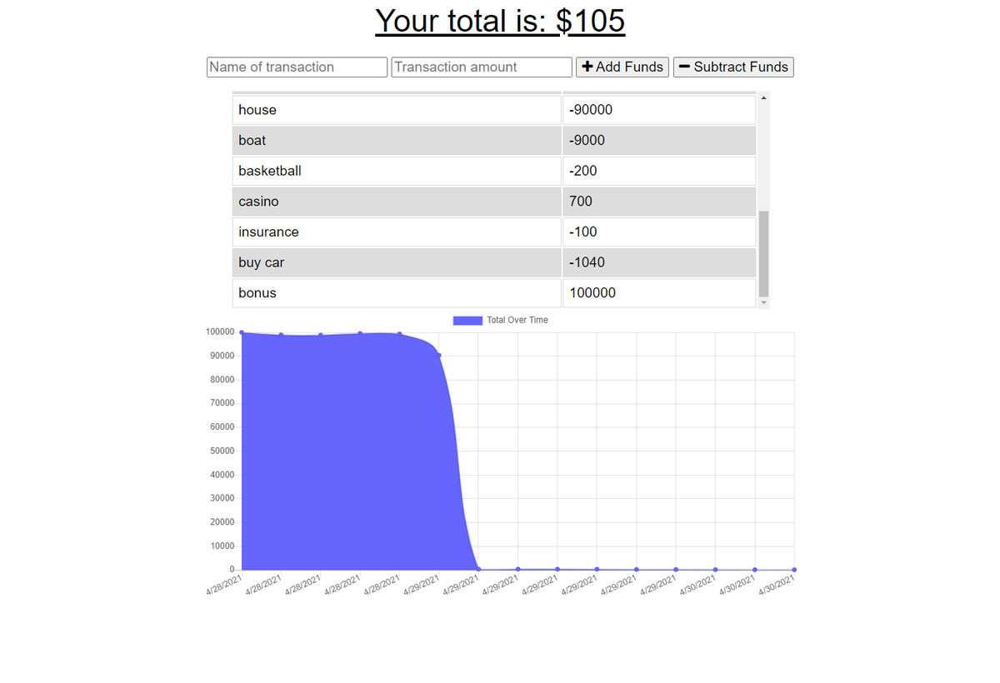

# budget-tracker

# Description
Budget Tracker is a Progressive Web Application that gives users a fest and easy way to track their money on and offline. When a user loses internet connection, Budget Tracker is still able to keep track of their transactions and will update automatically when the user regains connection. Built with Node.js, Mongoose.js, Express.js. See a live demo on heroku [here](https://safe-savannah-96754.herokuapp.com/).

# Table of Contents
- [Installation](#installation)
- [Usage](#usage)
- [License](#license)
- [Contributing](#contributing)
- [Tests](#tests)
- [Questions](#questions)

# Installation
After cloning the code run `npm install` in the root of the project in the command line. You must have MongoDB installed on your computer to run the application. After running `npm install` run `npm start` to start the server.

# Usage
The live application can be found [here](https://safe-savannah-96754.herokuapp.com/).

# License
This project is covered by the [MIT](https://spdx.org/licenses/MIT.html) license.

# Contributing
Julius Maxwell

# Tests
Currently there are no tests for this application.

# Questions
Contact me with any questions at my email or GitHub. [Email](mailto:jmax407@gmail.com), [GitHub](https://github.com/jmax407)